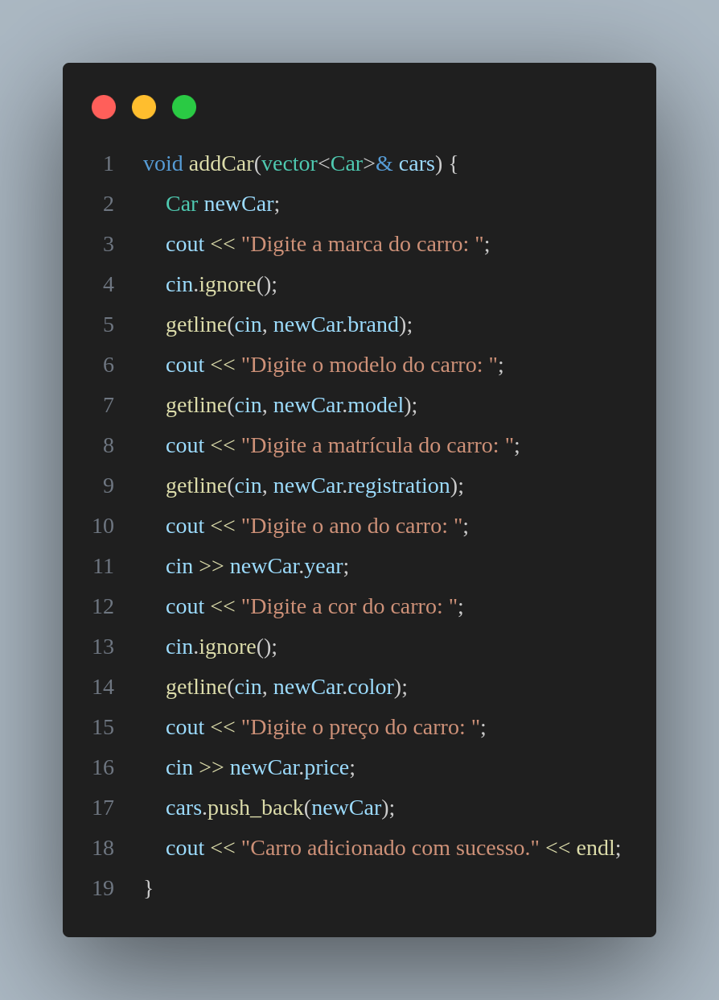
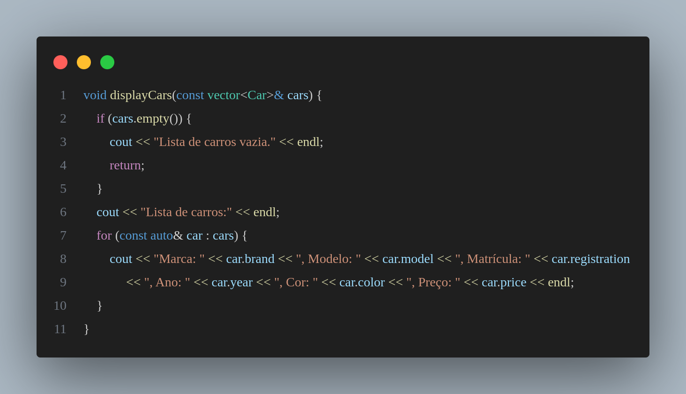
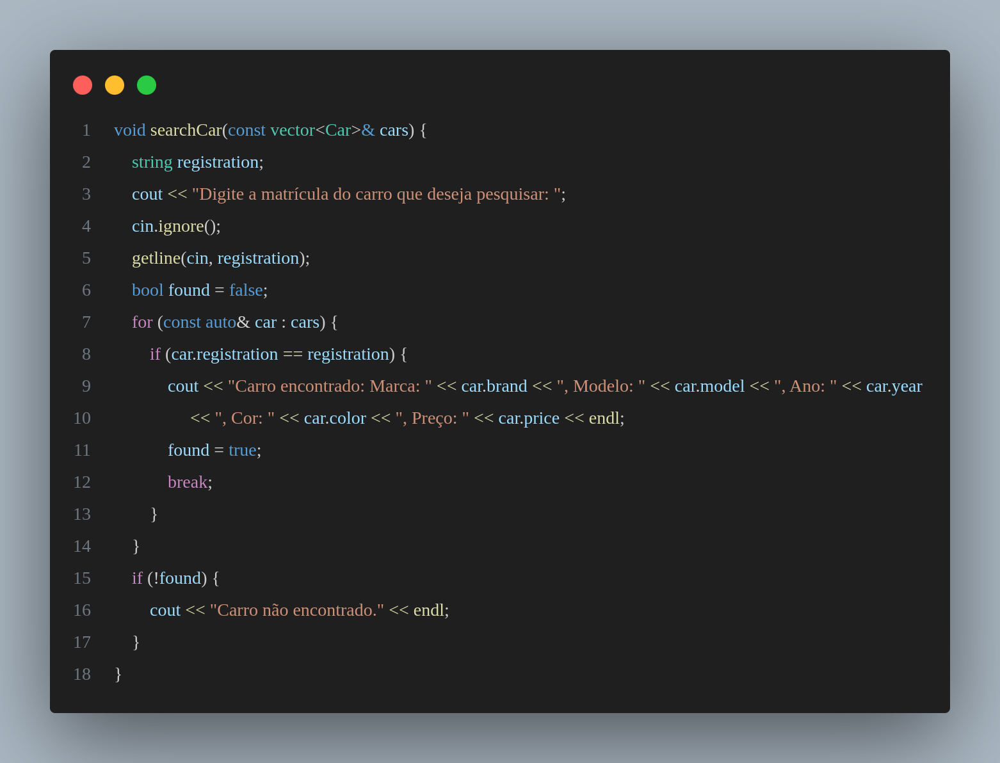
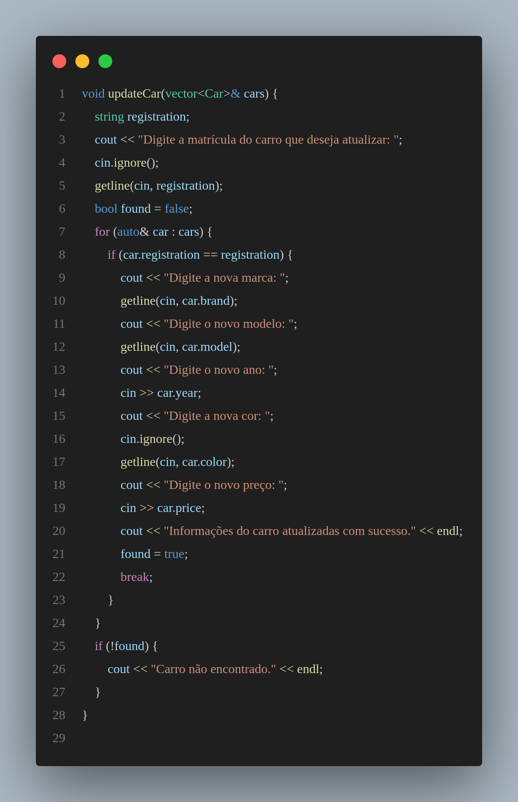
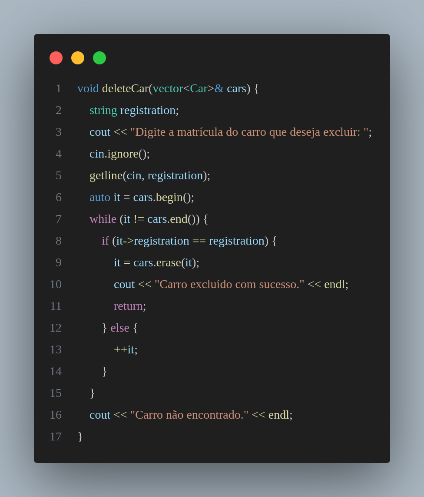
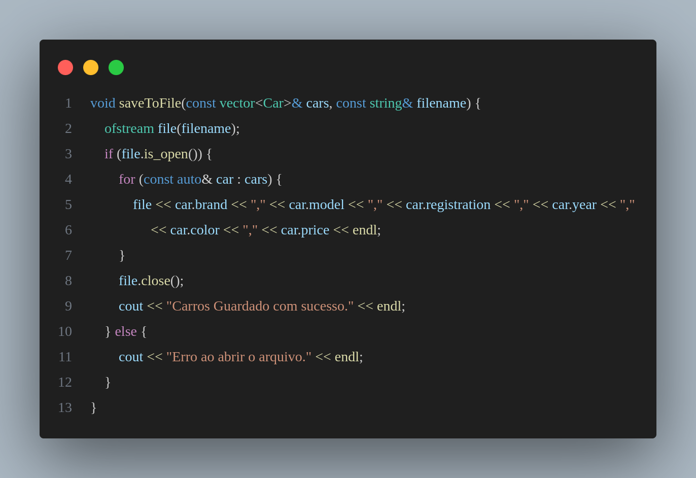
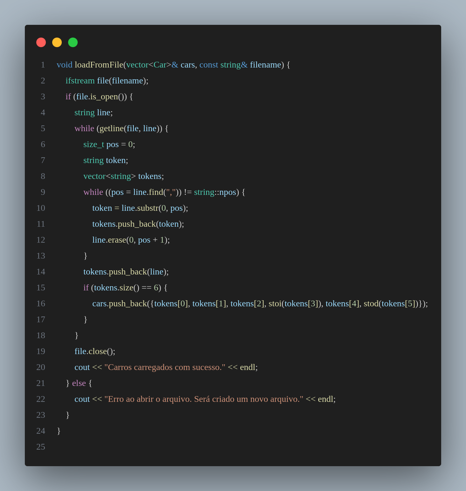

# Relatório - Lista de Carros de um Stand

Neste relatório, será fornecida uma explicação detalhada de cada função presente no código do gestor de carros de um stand, bem como uma visão geral do funcionamento do programa.

## Funções

Esta função permite adicionar um novo carro à lista de carros. Solicita ao utilizador que introduza as informações do novo carro, incluindo marca, modelo, matrícula, ano, cor e preço. Em seguida, adiciona o carro à lista de carros.

Esta função exibe todos os carros cadastrados na lista. Percorre a lista de carros e imprime no ecrã as informações de cada carro, incluindo marca, modelo, matrícula, ano, cor e preço.

Esta função permite ao utilizador pesquisar um carro específico pela matrícula. Solicita ao utilizador que introduza a matrícula do carro que deseja pesquisar e, em seguida, verifica se há um carro na lista com essa matrícula. Se encontrado, exibe as informações do carro no ecrã.

Esta função permite atualizar as informações de um carro existente na lista. Solicita ao utilizador que introduza a matrícula do carro que deseja atualizar e, em seguida, permite que o utilizador introduza as novas informações do carro, incluindo marca, modelo, ano, cor e preço.

Esta função permite ao utilizador excluir um carro da lista. Solicita ao utilizador que introduza a matrícula do carro que deseja excluir e, em seguida, remove o carro da lista, se encontrado.

Esta função guarda a lista de carros num ficheiro de texto. Recebe a lista de carros e o nome do ficheiro como parâmetros e, em seguida, escreve as informações de cada carro no ficheiro, separadas por vírgula.

Esta função carrega a lista de carros a partir de um ficheiro de texto. Recebe a lista de carros e o nome do ficheiro como parâmetros e, em seguida, lê as informações de cada carro do ficheiro, separadas por vírgula, e as armazena na lista de carros.

## Considerações Finais

O programa fornece um conjunto de funcionalidades básicas para gerir uma lista de carros de um stand, incluindo adicionar, exibir, pesquisar, atualizar e excluir carros. Além disso, implementa a persistência dos dados, permitindo guardar e carregar a lista de carros de/para um ficheiro de texto.

